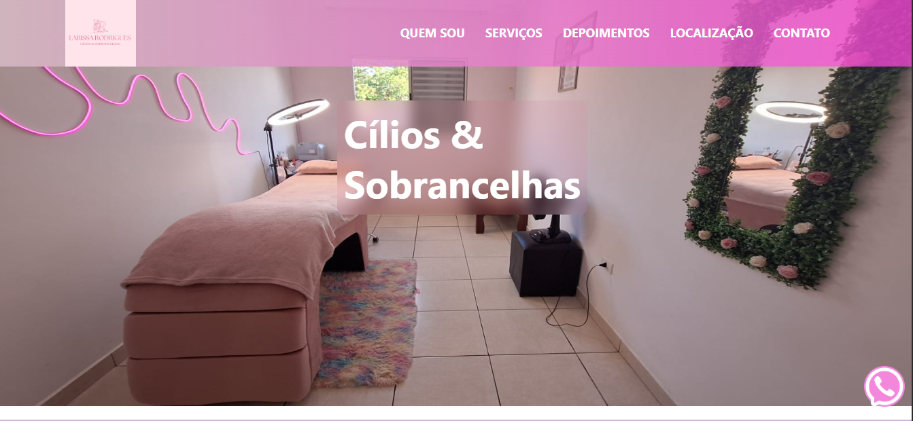
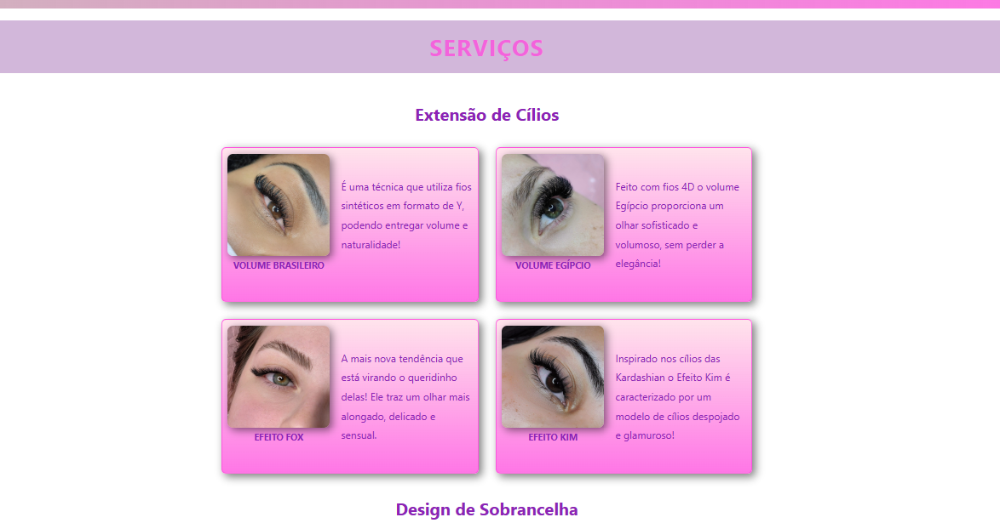

# Larissa Rodrigues | Cílios & Sobrancelhas 💖

Landing page desenvolvida para divulgação dos serviços de extensão de cílios e design de sobrancelhas oferecidos por Larissa Rodrigues.

## 🌐 Demonstração

🔗 [Acessar o site](https://lash-designer-one.vercel.app/) Acesse o site através deste link!

### 🖥️ Desktop 

  
  

### 💻 Tablet

  
  

### 📱 Celular

  
  

## 📌 Objetivo

Divulgar o trabalho profissional de **Lash Designer**, apresentando informações como:
- Quem é Larissa
- Serviços oferecidos
- Depoimentos de clientes
- Localização
- Formas de contato (WhatsApp)

## 🛠 Tecnologias Utilizadas e Ferramenta

- 
- 
- 
- 

## ▶️ Como Executar

1. Baixe os arquivos do projeto
2. Abra o arquivo `index.html` diretamente no navegador

> Não é necessário servidor local ou banco de dados. Tudo roda 100% no navegador.

## 🚀 Hospedagem

Este projeto está hospedado gratuitamente na plataforma **[Vercel](https://vercel.com/)**.

## 👨‍💻 Autor

- Desenvolvido por **Carlos Alcides** —  

---

